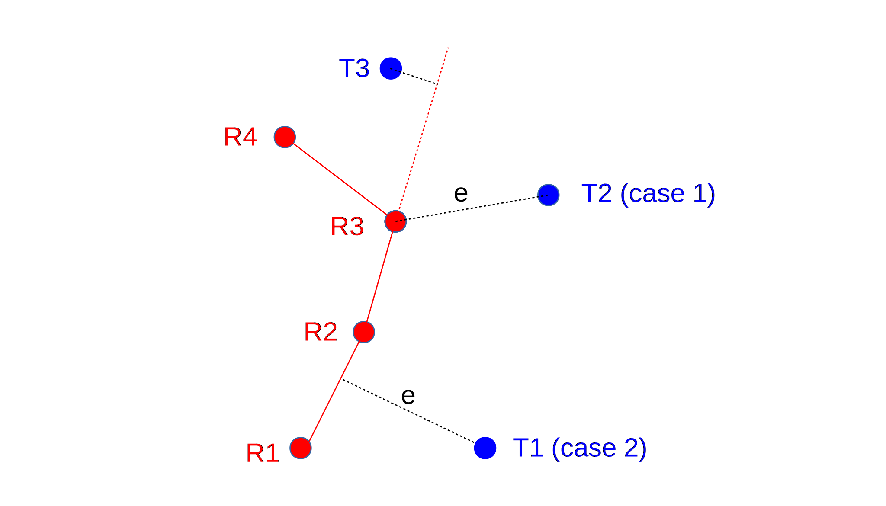

# gps-accuracy
The purpose of this script is to quantify the accuracy of a GPS device by
comparing the location of track points against points in the planned route. For details of the use of this script to assess the accuracy of a variety of GPS devices, please see [findings](https://robjordan.github.io/gps-accuracy/findings "Findings").

Usage:
```
gps-accuracy [-h] [-d] route track

positional arguments:
  route        filename of route (GPX track format)
  track        filename of track (GPX track format)

optional arguments:
  -h, --help   show this help message and exit
  -d, --debug  generate debug output, including a GPX file visualising
               tracking errors
```
The output reports on the mean, median and 95% percentile distance from each GPX
track point to the nearest point along the planned route. It also reports on the
start and finish time of the track, the number of trackpoints and the mean/max
interval between successive track points. 

The core of the algorithm is to find the nearest point on the planned route to
each track point. There are two main scenarios:

1. The nearest point along the planned route coincides with a route point. This
   is typically the case if the route is curving away from the track point under
   consideration. This is illustrated below, in the case of track point T2,
   where the error, e, is discovered by locating the nearest of all route points
   (R3) and simply calculating the Euclidean distance between the two points. 
  
2. The nearest point along the planned route lies somewhere on a line between
   two successive route points. This is illustrated below in the case of track
   point T1, where the closest route point lies on the straight line between R1
   and R2. The error line, e, is perpendicular to the line segment R1-R2. The
   point of intersection is found by considering the line R1-R2 as a linear
   equation y = mx + c, which implies that the slope of the line e must be -1/m.
   We can solve the resulting pair of simultaneous equations to find a point of
   intersection, and thus find the error distance, e, which is the Euclidean
   distance between T1 and the intersection. The complication is that we don't
   know which pair of route points present the closest line segment to track
   point T1. The heuristic method used, is to find the closest route point, R,
   to track point T, then consider line segments between R and its two
   predecessors and two successors: (R-2)-(R-1),  (R-1)-R, R-(R+1) and
   (R+1)-(R+2). For each segment, we calculate a point of intersection between
   the line and its perpendicular through T using the method of simultaneous
   equations. We eliminate any candidates where the intersection is not between
   the successive route points (for instance, point T3 to the extended line
   between R2 and R3) and select from the remaining candidates the shortest
   error distance.



## Assumptions

* Trackpoints in the `route` file are closely-spaced, such that the intended
  route can be considered to follow a straight line between successive route
  points. 
* Since the distances between points in the route and track are very small, the
  curvature of the earth can be ignored. The first step is therefore to convert
  the lat/long coordinates the route and track to XY coordinates (units are
  metres), and make distance calculations using Pythagoras theorem.
* The base maps used to create the planned route are accurate; specifically that
  the path of a road as described on the map accurately represents the path of
  that map in the real world. 