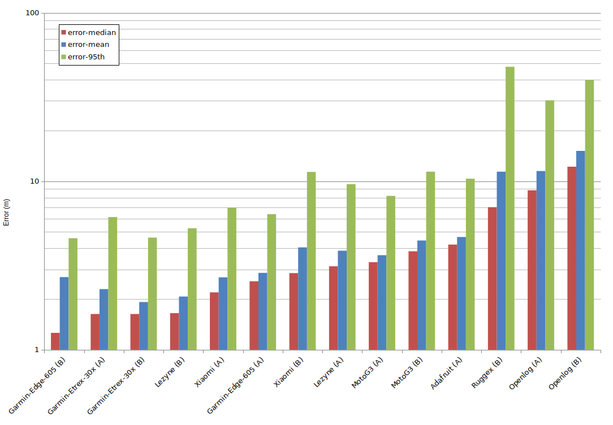

# What did we discover about the tracking accuracy of GPS devices?

The motivation for this piece of work was to discover whether there is any
significant difference in the ability of GPS devices to acccurately track a
planned route. The devices include popular dedicated GPS devices from Garmin and
Lezyne, several Android phones, and two home-built GPS devices. I had some
concerns about the accuracy of my home-built devices, and also one of my Android
phones, and therefore wanted an objective way to evaluate the accuracy of
devices. To do so, I developed [a Python
script](https://github.com/robjordan/gps-accuracy) to measure the accuracy of
each device.

## The devices

### [Garmin Edge 605](https://wiki.openstreetmap.org/wiki/Garmin/Edge_series#Edge_605)
Introduced in 2008, this item purchased in 2010, it was marketed as a 'cycle
computer', i.e. targetted more at sport cyclists, though the 605 lacks the ANT+
sensors of the more popular 705 (for heart rate, power, cadence tracking, etc). 
* Powered by an internal rechargeable lithium ion battery. 
* The GPS chipset is SiRFstar III. 
* The device tracks
  [GPS](https://en.wikipedia.org/wiki/Global_Positioning_System) satellites but
  not [GLONASS](https://en.wikipedia.org/wiki/GLONASS). 
* The interval between recorded track points can be configured to be every
  second, or "smart recording", which focuses more points in areas where speed
  or direction are changing. For this experiment the device was set to record
  every second.

### [Garmin eTrex 30x](https://wiki.openstreetmap.org/wiki/Garmin/eTrex_30x)
Introduced in 2015, it's marketed as an 'outdoor handheld', the focus being on a
rugged and water-resistant device for a variety of sports and lesiure activities
(cycling, walking, sailing, etc). 
* Powered by removable AA batteries. 
* Garmin does not reveal the GPS chipset used within the device. 
* The device tracks GPS satellites and also GLONASS. 
* The interval between recorded trackpoints can be configured to be a fixed time
  or distance, or set to 'auto'. For this experiment the device was set to
  'auto' with the hint of 'more often'. This resulted in a recorded track point
  on average every 6 seconds.

### [Lezyne Mega XL](https://ride.lezyne.com/products/mega-xl-gps)
Introduced in 2018, this item purchased in 2019, it's a cycle computer with ANT+
and Bluetooth sensor device support. The main selling point is extended battery
life (up to 40 hours).
* Powered by an internal rechargeable lithium ion battery. 
* Lezyne does not reveal the GPS chipset used within the device. 
* The device tracks GPS satellites and also GLONASS. 
* The interval between track points can be set to 'adaptive' or 1 second.
  Adaptive tracks points based on the GPS movement and can increase the runtime
  of the device. For this experiment, the device was set to adaptive. This
  resulted in a recorded track point on average every 2.5 seconds.

### [Xiaomi Mi A2 Lite Android phone](https://www.gsmarena.com/xiaomi_mi_a2_lite_(redmi_6_pro)-9247.php)
Introduced in 2018, this item purchased in 2019, it's a general-purpose Android
phone, with built-in GPS. 
* Running Android 9.
* Powered by internal rechargeable lithium ion battery.
* GPS is implemented within the Qualcomm MSM8953 Snapdragon 625 chipset.
* The device tracks GPS, GLONASS,
  [Galileo](https://en.wikipedia.org/wiki/Galileo_(satellite_navigation)) and
  [BeiDou](https://en.wikipedia.org/wiki/BeiDou) satellites, and also supports
  [assisted GPS](https://en.wikipedia.org/wiki/Assisted_GPS) to improve time to
  first fix, and potentially improve location accuracy in areas where satellite
  signal reception is poor, e.g. dense urban areas.
* Track points were recorded using
  [OsmAnd](https://wiki.openstreetmap.org/wiki/OsmAnd) with trackpoint interval
  set to 1 second.

### [Motorola Moto G3](https://www.gsmarena.com/motorola_moto_g_(3rd_gen)-7247.php)
Introduced in 2015, this item purchased in 2016, it's a general-purpose Android
phone, with built-in GPS. 
* Running Android 6.0.1.
* Powered by internal rechargeable lithium ion battery.
* GPS is implemented within the Qualcomm MSM8916 Snapdragon 410 chipset.
* The device tracks GPS and GLONASS satellites (Beidou is stated in chipset
  specs, but isn't received in practice), and also supports assisted GPS to
  improve time to first fix, and potentially improve location accuracy in areas
  where satellite signal reception is poor, e.g. dense urban areas.
* Track points were recorded using OsmAnd with trackpoint interval set to 1 second.

### [Ruggex Rhino 3](https://www.ruggex.com/rhino-three/)
Introduced around 2017, this item purchased in 2018, it's a ruggedised Android
phone built to meet IP68 water/dust protection standards, with built-in GPS. 
* Running Android 6.0.
* Powered by internal rechargeable lithium ion battery.
* Ruggex does not reveal the GPS chipset used within the device.
* The device tracks only GPS satellites (not Glonass, Galileo or Beidou), and
  states that it supports assisted GPS.
* Due to software issues it proved impossible to record track points every 1
  second using OsmAnd, so an alternative app, GPS Logger for Android, was used. 

### Hand-built GPS tracker number one: 'Adafruit'
I built this one with the intention for it to be a simple, unattended, fallback
GPS tracker, to ensure track points are captured on long rides, even if the
primary GPS device fails or crashes. A key ambition was extended battery life in
a small package.
* Logs for about 30 hours using a 1200mAh [Lithium Polymer pouch
  cell](https://www.adafruit.com/product/258).
* The microcontroller is a [ATSAMD21G18 ARM Cortex
  M0](https://www.microchip.com/wwwproducts/en/ATsamd21g18), packaged as the
  [Adafruit M0 Feather
  Datalogger](https://learn.adafruit.com/adafruit-feather-m0-adalogger).
* The GPS device chipset is [MediaTek
  MT3339](https://labs.mediatek.com/en/chipset/MT3339) packaged as a [Global Top
  PA6H](https://cdn-shop.adafruit.com/datasheets/GlobalTop-FGPMMOPA6H-Datasheet-V0A.pdf)
  with ceramic patch antenna.
* The device tracks only GPS satellites (not Glonass, Galileo or Beidou).

### Hand-built GPS tracker number two: 'Openlog'
The goals are the same as the first home-made tracker, but with longer battery life.
* Logs for about 100 hours using a 2900mAh [Lithium Ion 18650
  cell](https://lygte-info.dk/review/batteries2012/Samsung%20INR18650-29E%202900mAh%20%28Blue%29%20UK.html).
* The microcontroller is a
  [ATmega328P](https://www.microchip.com/wwwproducts/en/ATmega328p), packaged as
  the [Openlog Serial Data
  Logger](https://www.aliexpress.com/item/32827453862.html?spm=a2g0s.9042311.0.0.27424c4dOzq8yt).
* The GPS device chipset is [U-blox
  MAX-M8C](https://www.u-blox.com/en/product/max-m8-series) packaged as a
  [Uputronic MAX-M8C Pico
  Breakout](https://store.uputronics.com/index.php?route=product/product&path=60_64&product_id=72)
  with [JTI 1575AT43A40 Chip
  Antenna](https://store.uputronics.com/index.php?route=product/product&path=60_65&product_id=65).
* The device tracks GPS satellites as well as Glonass, Galileo and Beidou.

## The test procedure

To test the devices, I planned a 60km bike route, on-road, through a mix of
urban, open rural, and wooded areas. I treated the outbound and return legs,
which were about 30km each via different routes, as separate experiments. I
attached the Garmin and Lezyne devices, as well as the Ruggex phone, to
handlebars. The other phones and the hand-built devices were in rear pockets of
my jersey. (It would be desirable for future experiments to bar-mount the
devices consistently). 

After the ride, I gathered the GPX tracks from each device, cropped them
slightly to ensure that all track points were within the bounds of the planned
route, and begin and end while the bike was in motion.

Each track was then analysed using the
[`gps-accuracy.py`](https://github.com/robjordan/gps-accuracy) script.

Route and track files can be found [within the Github
repository](https://github.com/robjordan/gps-accuracy/tree/master/gpx).

## Results

For each route, and for each device that produced a satisfactory track, I
calculated the mean and max interval, in seconds, between trackpoints, and the
mean, median and 95% percentile error compared to the planned route. 

The Adafruit home-built failed to produce a route B track due to procedural
error. The Ruggex failed to produce a route A track due to software issues.

|Device (route)|interval-mean (s)|interval-max (s)|error-mean (m)|error-median (m)|error-95th (m)|
|---|---:|---:|---:|---:|---:|
|Garmin-Edge-605 (B)|1.0|2.0|2.7|1.26|4.59|
|Garmin-Etrex-30x (A)|6.1|34.0|2.29|1.63|6.13|
|Garmin-Etrex-30x (B)|6.9|33.0|1.92|1.63|4.63|
|Lezyne (B)|2.5|77.0|2.07|1.65|5.26|
|Xiaomi (A)|1.6|4.0|2.69|2.19|6.96|
|Garmin-Edge-605 (A)|1.0|4.0|2.86|2.55|6.38|
|Xiaomi (B)|1.6|3.0|4.05|2.85|11.36|
|Lezyne (A)|2.5|197.0|3.87|3.13|9.61|
|MotoG3 (A)|2.7|216.0|3.64|3.31|8.19|
|MotoG3 (B)|2.5|89.0|4.45|3.84|11.4|
|Adafruit (A)|5.1|18.0|4.67|4.21|10.36|
|Ruggex (B)|159.6|369.0|11.4|7.02|47.79|
|Openlog (A)|10.0|10.0|11.5|8.84|30.22|
|Openlog (B)|10.1|20.0|15.14|12.2|39.89|

The graph presents the mean, median and 95th percentile error for each device,
on a log scale, ordered by median.

